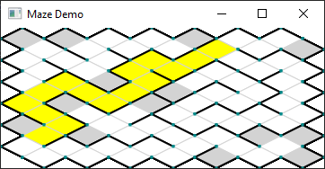

# maze-library
the maze lib is build ontop of the  [map lib](https://github.com/martinFrank/map-library)
and has all the features you know from the map lib.

## algorithms
currently it implements only 'recursive backtracker' but
i hope to provide more algorithms sooner or later


#### Example / Tutorial
this is a screen shot of the maze lib. Dead ends are colored with grey.
the mapStyle is ```MapStyle.SQUARE_ISOMETRIC```, obviously, and i've
calculated a shortest path (a*) which is colored in yellow.

:


